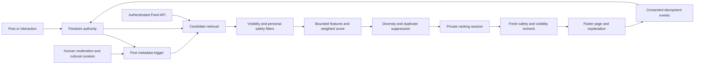
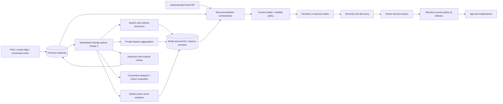

# Community recommendations: implementation and scale plan

Prepared October 1–2, 2026. **Backend deployed October 2** to
`project-kassena-7e026`; the mobile recommendation feature has not been released.
The Flutter rollout flag `COMMUNITY_RECOMMENDATIONS` defaults to false. Deploy and
validate the backend before building with `--dart-define=COMMUNITY_RECOMMENDATIONS=true`.

## Product contract

Following is chronological, drawn from followed accounts, reposts by followed
accounts, selected topics/cultures/languages/countries, and explicitly followed
public communities. For You balances those interests with recent public writing,
learning content, editorial choices and emerging contributors. Neither feed uses
payment status or cultural group size as a positive signal. Identity is never
inferred from language choice; interests mean what someone wants to read.

Existing `communityPosts` supports text, images, video, stories, questions, polls,
language posts and contributor posts. Replies remain in conversations and do not
become isolated recommendations. Likes, replies, bookmarks, shares, reposts and
account follows retain their current UI and edge collections. Education uses
the language category or an editorial education flag. Events can be ordinary
posts today; a structured event/RSVP model remains a Phase 2 feature.

## What is implemented

- Pure deterministic ranker: `services/functions/src/community-feed-ranking.ts`.
- Decaying private interest features and distinct-actor trend scoring:
  `services/functions/src/community-feed-signals.ts`; model `cultural-balance-v2`.
- Authenticated/rate-limited callables, retrieval, hydration, server-owned ranking
  sessions, moderation/curation API and post-index trigger in `community-feed.ts`.
- Firestore indexes, private preference access and server-only features/events.
- Flutter API client, stable session pagination, recommendation explanations,
  interest editor, more/less feedback, topic mute/restore and optional impressions.
- Opt-in recent likes/bookmarks/replies/reposts and recommendation events inform
  For You; inferred interests never add anything to Following.
- Dedicated editorial, emerging and expiring trending/popular retrieval pools;
  scheduled public-engagement sampling every 15 minutes.
- Legacy Following merges all of the mobile repository's up-to-300 follows in
  groups of 30; it no longer applies the For You resurfacing heuristic.

The API supports up to 3,000 follows and returns an explicit capacity error above
that ceiling rather than silently dropping people. Sessions rank up to 300 posts
and last 15 minutes; refresh starts a new session. This is an MVP serving design,
not a claim of million-user throughput. Load tests and staged rollout are required.

## Pipeline and data movement



1. An existing post write lands in Firestore. The trigger rereads current state
   rather than trusting trigger delivery order, and updates duplicate and date
   metadata. It preserves reviewer-owned moderation and curation fields.
2. Reviewers assign cultural tags and safety states through an audited callable.
   Post authors cannot assign their own reputation, quality, editorial status or
   safety score. A tag describes the content, not the author's presumed identity.
3. The feed API loads the viewer's follows, explicit interests and safety edges.
   It reads recent posts, followed-author groups, followed reposts, category and
   public-community matches, reviewed cultural/language/country tags and editorial
   posts, emerging contributors and fresh public trends. With activity consent,
   it derives private interests from recent owner edges and events, then queries
   related categories/cultural/language tags. IDs are deduplicated before hydration.
4. Hydration checks current community status and visibility. Global recommendations
   never retrieve private-community posts. Embedded quote snapshots are omitted
   until a separately authorized resolver can revalidate the original material.
5. Safety filters run before scoring. A stable ordering is stored privately;
   pagination uses session ID plus offset, binds the session to viewer and mode,
   and checks expiry. A cursor is not an authorization credential.
6. Every response rereads current posts and moderation. Deletion, new blocks,
   mutes, personal reports and closed/private communities apply to later pages.
7. The client requests more of the same session as its window grows. Pull to
   refresh and explicit preference changes start a fresh session. A session that
   expired restarts once; network/moderation errors do not fall back to unsafe
   unfiltered recommendations.

## Initial scoring formula

All feature values are in `[0,1]`, except the final weighted contributions.
Unknown trust signals contribute zero. Counts saturate and nonfinite values are
ignored. Scores are heuristics, not calibrated probabilities.

```text
score = 18 interest + 12 relationship + 6 engagement
      + 12 culture + 12 language + 8 community
      + 8 quality + 2 reputation + 14 freshness
      + 9 culturalDiscovery + 5 education + 3 emerging*freshness
  + 3 velocity + 3 popularity + 4 editorial
      - 24 negative - 12 previouslySeen - 40 spamRisk - 30 limited

freshness = 2 ^ (-ageHours / 24)
engagement = min(1, log(1 + min(likes,1000) + 2*min(replies,500)
                       + 2*min(reposts,500) + 3*min(bookmarks,500)
                       + min(shares,500)) / log(4001))
relationship = min(1, 0.7*followingAuthor + 0.3*max(trustedRelationship, behavioralAuthor))
culturalDiscovery = 0.4 + 0.4*relevance + 0.2*emerging
```

Discovery applies outside explicit follows or to a culture outside the viewer's
selected cultures, and earns a bonus when an interest bridge exists, the viewer
is cold-starting, or staff selected the post. A culture outside
the viewer's interests can bridge through a shared language, subject or community.
Culture and language matches use canonical lower-case labels in this MVP. Do not
guess translations or aliases; add reviewed IDs/aliases in Phase 2.

`interest` is the maximum of topic overlap, explicit "more like this" affinity
and 0.7 times behavioral topic affinity. Culture and language use the maximum
of explicit overlap and 0.7 times the respective behavioral affinity.
Overlap divides matched tags by up to three tags. Community is a selected public
community match. Following bypasses weighted sorting and uses descending post or
followed repost time. Reposts retain attribution; the original post timestamp still
controls freshness in For You. Every page rechecks current follows and interests.
Public engagement uses existing counts only, with a small bounded coefficient;
these counters are not proof of authentic engagement.

Aggregate bookmark/share counts and author reputation remain optional trusted
inputs without automated producers. Private saves inform only the consenting
owner's interests. Reviewer curation supplies quality/reputation and optional
velocity; the scheduled sampler supplies expiring popularity and velocity.
Impressions, profile visits from feed cards and share intents are connected in the
mobile UI. Dwell/watch/skip events are supported by ingestion and scoring but
require accurate client instrumentation in Phase 2. Search history is not collected.

### Private activity feature calculation

When consent is enabled, a fresh For You session reads at most 30 current likes,
30 bookmarks, 30 reposts, 30 authored public replies and 60 recommendation events
from the last 30 days. Seed posts are hydrated through the same visibility,
moderation, block, mute and report gates. Removed/private/muted material cannot
be used to construct interests. No other user's bookmark or viewing data is read.

Each post/action pair contributes at most once, even across sessions. Use weights
like=.7, bookmark=1, reply=.8, repost=.8, share intent=.6, profile visit=.2;
dwell contributes at most .3 after five seconds and watch at most .4 after three
seconds. Apply `2^(-ageDays/7)` decay, divide across the post's tags, then normalize
each feature with `1-exp(-sum)`. An impression is not positive interest: it only
adds a one-day repeat penalty. A skip adds at most .12 before decay/normalization.
Explicit less/not-interested feedback is much stronger. Long viewing never proves
agreement or truth. These are bounded proxies, not calibrated probabilities.

Retrieval uses the five strongest inferred tags per dimension above .15; these
are separate from explicit follow lists. Turning activity personalization off stops
event ingestion and behavioral feature reads, and invalidates existing ranked
cursors when the preference version changes. Re-enabling starts a new telemetry
consent epoch. Current social edges may inform the owner's feed while opted in;
event data from a previous consent epoch is ignored. Unliking/unsaving affects the
next refresh because features are reconstructed from current edges, not permanent
affinity increments. Existing event retention remains at most a 30-day TTL policy
plus asynchronous deletion lag; consent withdrawal is not an immediate erase job.

### Trending service

`updateCommunityFeedTrends` samples at most 200 recent public likes, 200 reposts
and 200 replies every 15 minutes. Only safe public original posts created in the
last seven days qualify. Limited posts and spam risk >=.5 are excluded from this
pool. Require five distinct actors; count an actor once per post; exclude the
author and cap each actor at 20 posts per refresh. No private saves/watch history,
raw report volume or author-controlled post counters enter the trend calculation.

Popularity is logarithmic and normalized against the maximum in each culture
(or topic when no cultural tags exist); a multi-culture post uses its lowest
normalized value. Velocity compares the last-hour actor count to the previous
23-hour rate with a baseline floor. Both features stay in [0,1], with only three
ranking points each. Entries expire after 30 minutes and conditional transactions
prevent an older job from overwriting newer trend state. Every served page still
rechecks safety. An outage lets trends expire; it does not serve stale scores.

This is a bounded sample, not an exhaustive platform-wide trend census or a bot
classifier. Monitor the logged `saturated` flag. Replace the sampler with streaming,
trusted-actor/cohort reservoirs when it saturates; otherwise a burst can consume
its retrieval budget. Normalization and final cultural caps reduce group-volume
dominance but are not evidence of equal exposure across the entire platform.

## Diversity and fairness

For You never places more than two consecutive posts from one author and allows
at most three posts by an author in a rolling ten slots. Within any
rolling ten slots it allows at most four posts for a named topic, culture or public
community. Multi-tagged posts count toward every applicable group, avoiding a
primary-tag loophole. Canonical IDs, identical media identifiers, content hashes
and token-set Jaccard similarity at least 0.85 (minimum six tokens) suppress repeats.
This lexical heuristic is not semantic near-duplicate or perceptual-image detection.

Soft selection bonuses target two to four discovery posts per ten, a learning post
and an emerging contributor when inventory supports them. There are no guaranteed
quotas when eligible inventory is absent. Hard safety, duplication and concentration
rules are never relaxed to fill a page. Small single-topic inventories may therefore
produce a short For You feed; Following remains available for the full timeline.
Unknown culture labels do not create a fictional shared culture bucket.
After rehydration, delivery rechecks hard author/topic/culture/community limits
against the last nine previously issued posts before the cursor and newly added
page items. Intervening post edits or removals therefore do not silently bypass
the window constraints. This may skip more items or produce a short page. Duplicate
suppression uses the session's original content snapshot; semantic duplicates and
cross-session repetition controls beyond one-day impressions remain Phase 2.

## Cold start

- New reader: the interests editor supplies explicit cultural, language and subject
  interests. Until selected, freshness, learning, editorial and controlled discovery
  provide a useful ordering. No identity, precise location or contacts are inferred.
- New post: no engagement is needed for a freshness/interest score. Recent retrieval
  admits it immediately. Future timestamps beyond a one-minute tolerance are excluded.
- Emerging contributor: reviewer-owned `emerging` adds a small freshness-dependent
  opportunity and a diversity bonus; follower count does not decide quality.

## Candidate source roadmap

| Source | MVP implementation | Phase 2 |
|---|---|---|
| Followed accounts/reposts | Chunked Firestore fan-in | Hybrid inbox fan-out |
| Followed topics/public communities | Indexed category/community queries | Taxonomy IDs and membership-derived public affinity |
| Cultures/languages/countries | Reviewed feature tags, explicit selections | Alias registry and multilingual retrieval |
| Recent/new posts | Latest 120 global posts | Rotating per-culture reservoirs |
| Editorial/emerging creators | Reviewed flags and dedicated retrieval | Exposure-budgeted rotating emerging-creator pool |
| Popular/trending | Distinct-actor expiring public sample; cohort-normalized popularity | Streaming trusted-actor hourly trend reservoirs |
| Similar users' likes | Not served | Privacy-thresholded collaborative retrieval |
| Previous likes/bookmarks/replies | Opt-in bounded owner history with decaying interests | Cached incremental profiles with deletion support |
| Search history | Not collected | Separate explicit opt-in and short retention, if justified |
| Location | Selected countries only, opt-in | Optional coarse region; never precise GPS by default |

## Data models and ownership

| Model | Existing or new storage | Important fields / constraints |
|---|---|---|
| User | Auth + `communityProfiles/{uid}` | Public name/avatar; private auth and preference records separate |
| Post | `communityPosts/{id}` | authorId, text, media[], isReply, parentId, rootId, category, poll, createdAt, communityId |
| Follow | `communityFollows/{uid_target}` | followerId, followingId, createdAt; existing unique pair |
| Community | `communitySpaces/{slug}` | visibility, status, category; private posts in `posts` subcollection |
| Culture / tribe | existing `communities` registry | Explicit cultural or tribal interests; content tags never infer ethnicity; Phase 2 reviewed stable ID mapping |
| Language | existing `languages` registry | Canonical language/dialect IDs; Phase 2 tag mapping |
| Topic | existing category vocabulary | question, language, culture, music, story, announcement; Phase 2 richer topic registry |
| Like | `communityLikes/{uid_post}` | uid, postId, createdAt |
| Reply | `communityPosts/{id}` | parentId/rootId, own author; not ranked as top-level |
| Repost | `communityReposts/{uid_post}` | reposterId, postId, createdAt; canonical engagement target |
| Bookmark | `communityBookmarks/{uid_post}` | Private owner edge; no public list of savers |
| View | `communityViews/{uid_post}` | Existing public-counter mechanism; separate from recommendation telemetry |
| Impression | `communityRecommendationEvents/{hash}` | kind=impression, uid, postId, sessionId, model, timestamps |
| WatchEvent | same event collection | kind=watch, milliseconds in 0..300000; future client integration |
| Report | `communityReports/{id}` | reporterId, postId, reason, status; staff-readable only |
| UserInterest | `communityFeedPreferences/{uid}` | up to 30 per dimension, explicit affinity/negative maps, mutedTopics, consent flags/epoch; behavioral profile derived privately per refresh |
| RecommendationEvent | `communityRecommendationEvents/{hash}` | Hash of actor/session/post/kind ensures idempotency; server-only |
| Ranking session | `communityFeedSessions/{random}` | uid, mode, model, preferencesUpdatedAt, ordered IDs/reasons, issued IDs, expiry; server-only |
| Trusted features | `communityFeedFeatures/{post}` | tags[], cultural/language/country labels, quality, reputation, moderation, spamRisk, editorial, emerging; trendPopularity/trendVelocity/trendUniqueActors/trendAsOf/trendExpiresAt |

Rules deny all client writes to new collections; owners can read only their own
preferences. Callables validate inputs and require auth; moderation additionally
requires reviewer authority. Expiry policies are declared for sessions and events.
Event collection retention is 30 days, but Firestore TTL deletion is asynchronous;
operational cleanup must be monitored. Consent off stops new recommendation events.
Existing view counters predate this opt-in and are not converted to private training
data. Add a privacy deletion/export worker before training on behavioral histories.

## API contract

Implemented as Firebase callable functions (SDK handles ID tokens and envelopes).
An HTTP gateway can expose the REST equivalents later without changing the ranker.

| Callable | Future REST mapping | Request / response |
|---|---|---|
| getCommunityFeed | GET /v1/feed | `{mode: 'for-you' or 'following', limit: 1..50, cursor?}` → `{items:[{id,post,reason}], sessionId,model,nextCursor}` |
| saveCommunityFeedPreferences | PATCH /v1/me/interests | Partial selected lists and boolean consent flags → `{ok:true}` |
| communityFeedFeedback | POST /v1/feed/feedback | `{postId,action: more/less/not-interested/mute-topic/unmute-topic}` → `{ok:true}` |
| recordCommunityRecommendationEvent | POST /v1/feed/events | `{sessionId,postId,kind,milliseconds?}` → `{recorded:boolean}` |
| curateCommunityFeedPost | PATCH /v1/moderation/posts/:id | `{postId,moderation,reason, optional tags/flags/scores}` → audited change |

Timestamps are recursively encoded as `{__timestampMillis: number}` for the Flutter
adapter. Page size is validated, not silently clamped. Sessions cannot be used by a
different account or mode. Event ingestion checks that the post was actually issued
by that session, uses server time, clips no arbitrary invalid values, and rejects
invalid durations. Client event telemetry is an untrusted observation, not a reward.

```text
feed(viewer, mode, cursor):
  authenticate and rate-limit
  load current follows, explicit preferences, hides, mutes, both block directions
  if no cursor:
    if For You and activity consent: derive bounded decaying private interests
    retrieve bounded source pools; merge IDs
    hydrate posts + trusted features + current community visibility
    reject private, removed, quarantined, hidden, blocked, muted, reported posts
    extract bounded features; score; sort with deterministic ID tie-break
    enforce diversity and duplicate policy
    persist viewer-bound 15-minute ordered session
  validate cursor ownership/mode/expiry
  rehydrate each requested slice and reapply safety
  mark returned IDs as issued; return page and next offset
```

## Safety and integrity operations

The implementation is a **policy enforcement boundary**, not an automated detector
for every harm. `allow` participates normally; `limited` loses 30 points;
`quarantine` and `removed` never enter recommendations; spamRisk >= .85 is excluded.
A personal report hides a post for that reporter immediately on the next request.
Report volume alone never establishes guilt or amplifies a coordinated brigade.

| Risk | MVP enforcement | Required operational/Phase 2 detector |
|---|---|---|
| Spam and duplicates | Bounded counts, hashes/media/token duplicates, moderator spamRisk | URL/repetition/burst features, perceptual hashes |
| Bots | Auth, optional App Check, rate limits, low weight for counts | Account/device risk with review and appeals |
| Manipulated engagement | No automatic trust from client events; capped popularity | Unique-actor aggregates, reciprocal-ring/cohort anomaly detection |
| Misinformation | Reviewer limited/quarantine decisions | Claim context and evidence review; no language-only truth classifier |
| Hate/harassment and NSFW | Quarantine/removal and reports | Text/image/video screening with language-specific evaluations |
| Cultural disrespect | Cultural-context reason and human moderation | Paid community reviewers, restricted-knowledge policy and appeals |
| Impersonation | Existing verified-profile system; reviewer quarantine | Identity reports and account-level enforcement |
| Coordination | Rate limits and no raw-report-count penalty | Time/cohort anomaly monitoring with false-positive audit |

Recommendation exclusion is not deletion from the whole platform: existing public
post reads remain public, and legacy clients do not consume these new moderation
features. Severe removals must use existing staff deletion/account controls as
well. Private communities keep their existing access rules. Audit and expose this
boundary clearly to moderators before rollout; do not describe it as universal
content removal.

## Indexes, budgets and scale architecture

Existing indexes cover isReply/authorId/createdAt, repost reposterId/createdAt,
communityId/isReply/createdAt and followerId/createdAt. This change adds
isReply/category/createdAt, feature tags(array)/createdAt, editorial/createdAt,
emerging/createdAt, trendExpiresAt/trendPopularity and owner-event uid/createdAt,
plus unindexed TTL expiry fields and session item/issued arrays. Existing owner
like/bookmark/repost and authored reply indexes cover behavioral reads. Trend
sampling uses single-field createdAt indexes and isReply/createdAt for replies.
`trendExpiresAt` is indexed for retrieval, not a TTL field; stale documents retain
their moderation data. Review index readiness in staging before enabling.
Firestore queries support up to 30 disjunctions, which drives chunking here;
see [Firestore query documentation](https://firebase.google.com/docs/firestore/query-data/queries).

For a normal small follow graph, one refresh reads source candidates, two documents
per hydrated post, safety edges and community visibility. Pages read at most twice
their candidate count plus small metadata sets and up to nine hydrated preceding
items for diversity rechecks. At the 3,000-follow ceiling, fan-in
is expensive; this ceiling is defensive, not a recommended latency target. Record
read counts and p50/p95 latency by follow-count bucket before increasing traffic.
Opted-in refreshes additionally read at most 180 owner activity documents and
two documents per unique seed, plus relevant community visibility records.
The sampler scans at most 600 action documents per run and hydrates only groups
with at least five actors. No benchmark or million-user SLA is claimed here.

MVP uses Functions + Firestore + a private session cache. At tens of thousands of
active users, split candidate retrieval and feature aggregation into Cloud Run
workers fed by Pub/Sub. Precompute per-topic/culture recent, emerging and trending
reservoirs. A recommendation service orchestrates these pools and the same stateless
ranking module. Redis caches pool IDs and versioned profiles; a cache hit never
bypasses current block, visibility or removal checks.

At hundreds of thousands/millions, use hybrid fan-out: ordinary accounts write
follower inbox IDs; very large authors are merged at read time. Shard ingestion,
avoid one counter or monotonically indexed timestamp becoming a write hotspot,
and use idempotent at-least-once workers. [Firestore sharded timestamp guidance](https://firebase.google.com/docs/firestore/solutions/shard-timestamp)
describes the relevant write/index tradeoff. Keep Firestore as the canonical
application authority; search indexes and caches contain derived data only.

Use a dedicated search/vector index for semantic retrieval, with deletion events
and visibility filters. Send consented, pseudonymous events to an analytics queue
and partitioned warehouse; restrict access, enforce retention/deletion and maintain
taxonomy/model versions. Trending should count distinct eligible actors in one-hour
and 24-hour windows, apply minimum cohort sizes, cap per-author contribution and
normalize within cultural/topic reservoirs so a large group cannot own every slot.

### Service responsibilities and deployment boundaries

These are logical boundaries for the MVP, with separate deployment units when
traffic justifies them. Independent microservices are not required to serve the
first thousand users.

| Component | MVP location and contract | Scale evolution |
|---|---|---|
| Feed API | Auth/App Check/rate limit, page-size validation, session ownership, serialization in `getCommunityFeed` | Regional gateway; latency and request budgets; client-compatible versioned callable/REST API |
| Recommendation orchestrator | `getCommunityFeed`: compose profile, sources, policy, score and session | Cloud Run; bounded parallel RPCs; model/policy version and experiment assignment |
| Candidate generation | `generateCandidates`: union source IDs then safe hydration | Precomputed per-author/culture/language reservoirs, inbox fan-out, collaborative/search retrieval with distinct source budgets |
| Ranking service | Stateless `rankFeed`, bounded interpretable features | Independent model serving; same hard policy gates; heuristic fallback on timeout |
| User profile/interests | `viewerFor` and `loadBehavior`, owner-only explicit preferences, ephemeral activity profile | Versioned private feature store and Redis; decay, consent epochs and edge-deletion reconciliation |
| Engagement tracking | Existing unique social edges, served-session idempotent recommendation events | Idempotent event ingestion → queue; immutable events with event ID, server time, consent version and canonical post ID |
| Trending | `updateCommunityFeedTrends`, expiring distinct-actor public sample | Stream processor and time buckets; minimum cohorts, actor risk, per-culture exposure budgets |
| Moderation | Current personal controls plus audited `curateCommunityFeedPost`, separate staff deletion | Text/media/account/cohort detectors → human cultural review/appeal queue; policy-state invalidation on every serving tier |
| Cache | Private Firestore session, 15-minute expiry; never an authorization source | Redis source-ID pools/profile versions; safety revalidation even on cache hits; TTL/stampede control |
| Database/media | Firestore canonical posts/edges, existing Cloud Storage media | Sharded derived aggregates, hybrid fan-out; canonical visibility remains authoritative |
| Search/indexing | Post metadata trigger, reviewed retrieval tags; no search-history ingestion | Multilingual lexical/vector index, public visibility filter, tombstones and deletion reconciliation |
| Analytics | Local checks plus operational trend sample logging | Pseudonymous consented stream → partitioned warehouse; cohort metrics, retention/deletion jobs, experiment dashboards |



Worker events must include event ID, canonical entity ID, operation/version and
server timestamp. Use an outbox or durable change stream, retry with backoff and a
dead-letter queue, and reconcile indexes regularly. Duplicate/out-of-order writes
must not reset moderation or resurrect deleted/private content. Firestore triggers
have at-least-once delivery and no ordering guarantee; the MVP indexing trigger
uses a transaction to reread current canonical state. See the official
[trigger guarantees](https://firebase.google.com/docs/functions/firestore-events)
and [transaction guidance](https://firebase.google.com/docs/firestore/manage-data/transactions).

The future candidate-service response should be `{postId, source, sourceScore,
retrievalVersion}`; sources include follow graph, explicit interests, behavior,
collaborative, trending, editorial, emerging and approved regional pools. Merge
with canonical post-ID deduplication and retain all source provenance. Reserve
inventory per source/culture before truncation so one prolific author cannot fill
an entire author query. The MVP queries every follow chunk, but its per-chunk
limits do not guarantee retrieval from each followed author. Do not advertise
complete timelines or unlimited history with these bounded reservoirs.

Collaborative retrieval should use aggregate cohorts with at least 20 consenting
readers, never return user identities or expose private bookmarks, and never use
private-community membership as a public recommendation explanation. Public
membership-derived participation may be included with permission. Search history
requires a separate opt-in, short retention and an erase control; the existing
activity toggle does not authorize collecting searches. Coarse location requires
explicit permission and a dedicated regional pool; selected countries are the
only location signal in the MVP.

For ML logs, add item position, source, policy/model/feature versions, calibrated
score and exploration propensity. Present explanations from verified retrieval
and features, not generated guesses about identity. Taxonomy records should carry
`id, kind, displayName, reviewedAliases, relatedIds, stewardship, status`; culture
and tribe labels follow community-approved terminology. Language learning intent
must be explicit before saying "Because you're learning Ga"; the current choice
means following a language. Name-specific trending explanations require a valid
tagged trend cohort rather than a generic popular count.

Start load testing with measured p95 latency, reads per refresh/page, query pool
coverage, session size, function concurrency, trend saturation and write contention.
Suggested rollout gates are p95 feed latency below 1 second at the agreed traffic
level, zero known visibility/block leaks, functioning rollback and no worsening
report/hide or culture concentration metrics. These are targets, not measured
results. Load-test ordinary and 3,000-follow accounts separately. Autoscaling alone
does not fix expensive fan-in. Reuse infrastructure already operated by this
Firebase repository; adopt Cloud Run/Pub/Sub/Redis only as demonstrated bottlenecks
require them. Follow [Firestore index/hotspot guidance](https://firebase.google.com/docs/firestore/best-practices).

## MVP, Phase 2 and machine learning

Ship the MVP after staging checks: explicit interests, existing social actions,
deterministic scoring, reviewed tags, diversity, personal safety, explanations and
audited curation. Keep behavioral data opt-in and turn App Check enforcement on
once configured for all consuming clients. Monitor permission and index failures.

Phase 2 supplies collaborative candidate producers, culturally reviewed taxonomy
aliases, membership-derived public recommendations, structured cultural events,
moderator tooling, deletion/export jobs, trusted streaming engagement aggregates,
dwell/watch/skip instrumentation, regional reservoirs, search retrieval and Redis/queue
infrastructure. Add session diversity state across longer browsing horizons and
measure the short-feed tradeoff for minority topics. Add in-app interest suggestions
to replace free text with the reviewed registry as its coverage grows.

Only after sufficient consented data and cohort coverage, replace hand weights
with a calibrated multi-task model estimating meaningful replies, saves, completion,
learning satisfaction and negative feedback. Dwell alone is not satisfaction. Use
time-based train/validation splits, position/exposure propensity correction and
randomized exploration logs; separate private data from public feature material.
Evaluate by language, culture, device capability and emerging-creator cohort.
Learned retrieval/ranking must preserve the independent safety and diversity gates.

Success metrics: learning/satisfaction surveys, meaningful replies, unique cultures
and authors reached, emerging-creator exposure, saved learning content, hides,
reports, duplicates, appeal reversals, concentration, latency and read cost. Watch
for unequal error rates in low-resource languages. Use gradual experiments with
rollback guardrails; never optimize time spent as the only objective.

## Verification and rollout

October 2 backend verification: Functions TypeScript build, 18 ranker/API unit
tests and 12 isolated Firestore integration tests passed. Integration checks cover
more than 30 follows, session ownership, page safety changes, private/quote
suppression, consent/idempotency, repost attribution, rules, behavioral retrieval
beyond the global reservoir, consent withdrawal, emerging/trending retrieval,
unsafe trend exclusion, idempotent post indexing and delivery diversity after
edits. Emulator shutdown succeeded. The 251-test Community mobile suite passed,
followed by eight updated client/preferences tests, including stable pagination,
per-kind event deduplication, expiry refresh and network retry. Flutter analysis
of Community and those two test files reported no issues. After integrating the
latest GitHub main, the Functions build, 18 backend tests and 12 integration tests
passed again; the upstream Labs helper tests and Blogger theme checks also passed.
No signed-in staging UI session, physical phone check or load test is claimed.

### Production delivery evidence — October 2, 2026

Implementation commit `a268f80` was pushed with upstream integration at
`6c1bd3e9ab45ddfe82b6d85820b498d67be135ec`. Firebase deployment completed for all
five Community callables, `indexCommunityFeedPost`, `updateCommunityFeedTrends`,
Firestore rules and indexes in `project-kassena-7e026`, region `us-central1`.
At 12:16 UTC, the Cloud APIs confirmed all seven functions `ACTIVE`, all six new
composite indexes `READY`, both TTL policies `ACTIVE`, and the 15-minute scheduler
`ENABLED`. An unauthenticated feed request returned HTTP 401/UNAUTHENTICATED.

The metadata backfill scanned and updated 66 existing posts without changing
curation. A follow-up dry run reported zero changes and zero skipped posts.
An isolated temporary production Auth account verified authenticated For You
(`cultural-balance-v2`), empty Following before explicit follows, consent-off event
rejection, consented/idempotent impressions, private less feedback and preference
cursor invalidation. The test account, its preferences, sessions, events and rate
limit rows were removed afterward. No real member's follows or preferences changed.

Sanitized deployment and smoke receipts are saved in
[`community-feed-deployment.json`](community-feed-deployment.json). This confirms
backend deployment and API behavior; it does not establish released mobile/UI
availability, universal moderation, trend-job execution, or production load capacity.

Run `npm run test:community-feed` and `npm run test:community-feed:integration`.
The latter uses `.community-feed-test.firebase.json`, demo project
`demo-indigen-feed-tests`, Firestore port 8188 and separate hub/logging ports to
avoid an existing emulator on 8080. Java 21 must be on PATH. On this machine an
isolated `FIREBASE_EMULATORS_PATH` was used under `.tooling/feed-emulators`.
Run the Community Flutter tests and analysis. Stage functions/rules/indexes, curate
sample cultural tags, exercise two accounts and a private community, then build
the opt-in mobile variant. Verify pagination while deleting/muting a post, and that
switching accounts discards the previous session. Configure TTL in the target
project and monitor deletion lag. Deployment, app-store release and community
publication are separate steps; none is implied by these files.

Existing-post metadata backfill (defaults to a read-only dry run):

```powershell
npm run build:functions
node services/functions/scripts/backfill-community-feed-features.mjs --project YOUR_PROJECT_ID
node services/functions/scripts/backfill-community-feed-features.mjs --project YOUR_PROJECT_ID --apply
```

The script uses Application Default Credentials or `FIRESTORE_EMULATOR_HOST`.
Add `--firebase-login` to use an existing Firebase CLI login in memory when ADC
is unavailable; this requires the repository's development dependencies. It
does not write credentials to disk or print tokens.
It pages by document ID, skips invalid timestamps, rereads posts transactionally
before applying metadata, and preserves all reviewer/trend fields. It does not
guess cultural tags, change moderation or mark accounts as emerging. Review its
dry-run summary before applying. Stage representatively curated tags separately.
